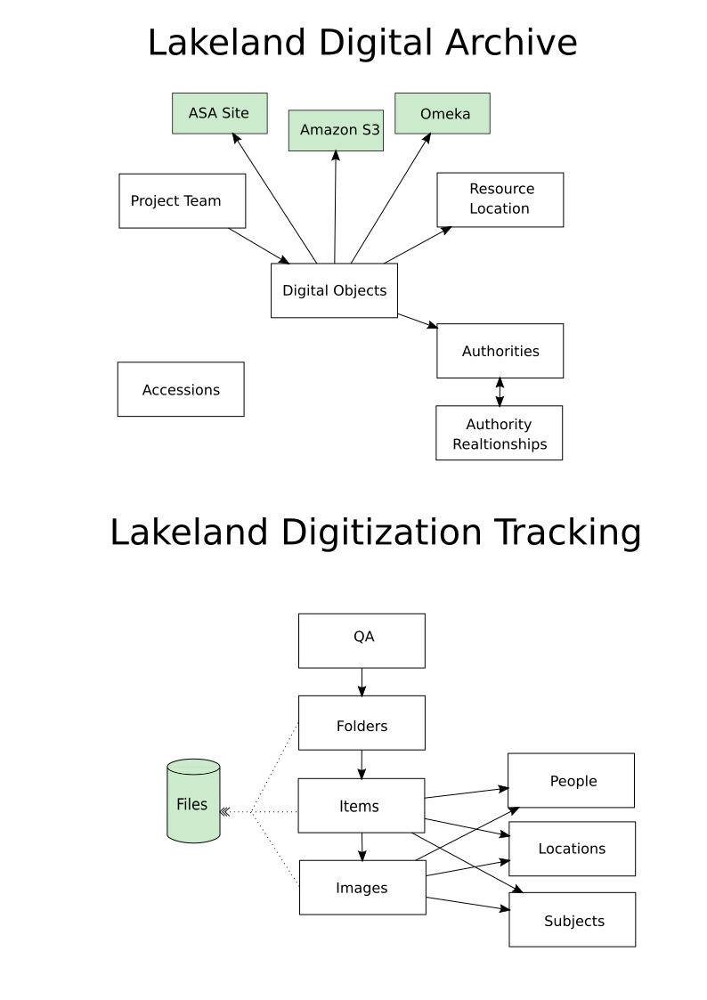
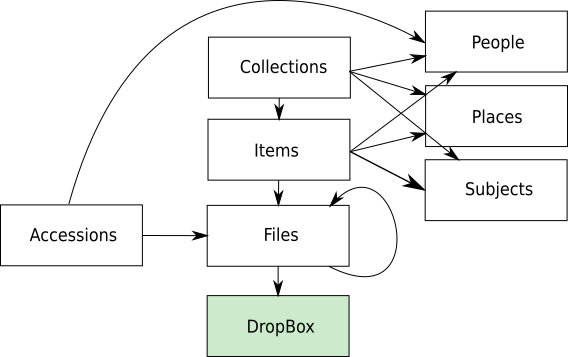

# lakeland-data-munging

This repository is an assortment of things to help study and consolidate some
of the data that was collected and described using Airtable on the Lakeland
project.

## Bases

There are currently three Airtable Bases containing information about records collected during the Lakeland project. The goal is to consolidate them into one and provide a shared approach to modeling the files and their storage which metadata can be layered on top of.

* Lakeland Digital Archive: This is the primary Airtable base that has been used to curate metadata related to digital objects.
* Lakeland Digitization Tracking: This base was used during Lakeland
  Digitization events to track the digitization of physical materials.
* Lakeland Digital Archive Data Tracking: This base has been used to track a variety of metadata related to the project. The only thing that hasn't been moved over to Lakeland Digital Archive or Lakeland Digitization Tracking is the Inventory: Omeka Items table.

## Inventory

This is an inventory of the tables in all these bases, and their columns.

### Lakeland Digital Archive

#### Project Team

* Name
* Title
* Affiliation
* Email Address
* Website
* Associated Digital Objects: Link to Digital Objects

#### Accessions

* Donor Name
* Donor Email Address
* Date of Donation
* Accession Notes
* Attachments
* Accession #
* Consent Acknowledgment

#### Digital Objects

* GUID: Formula (Object Type, UMD Identifier)
* Object Type
* Object Category
* UMD Identifier
* Description
* File Path: original location of the file?
* Individual/Group: select (individual, group)
* Audio/Video: select (Audio, Video, AudioVideo)
* Duration: time duration
* Accession Date
* Contributor
* Creator: Link to Authorities (zero or more)
* Format: text (mime-type)
* Project Team: text (not linked to Project Team table)
* Lakeland Collection: ?
* People: Link to Authorities (zero or more)
* Places/Organization: Link to Authorities (zero or more)
* Publisher: Link to Authorities (zero or more)
* Subjects: Link to Authorities (zero or more)
* Title
* Virtual Location: URL (mith-lakeland-media s3 bucket)
* Resource Location(s): Link to Resource Loctations (zero or more, should be 1?)
* Source (Provenance): Link to Authorities (MITH, City of College Park, Thelma Lomax, etc)
* File Name: Text (Edwardses.MP3, etc)
* Legacy Identifier
* Transcripts: attachment (docx, txt)
* Interviewer: Link to Project Team
* Checksum: text (md5)
* In Lakeland Book?: boolean
* Address: a place related to the digital object?
* Lakeland Book Chapter: select (chapters of the book)
* Lakeland Book Page Number
* Flag for Removal
* Used in Lakeland Video

#### Authorities

* Name
* Authority Type: select (Subjects, Persons Corporate Bodies or Families)
* Entity Category: select (Person, Corporate Body, Family, Concept, Object, Event, Place)
* Source Code: ?
* Alternate Name: text (only one?)
* Date of Birth: date (only relevant for people?)
* Date of Death: date (only relevant for people?)
* Biography/History: text (for more than people?)
* Address: text (only relevant for Places?)
* Authority Relationship: Link to Authority Relationships (zero or many)
* Notes

#### Authority Relationships

* Name
* Authority1: Link to Authorities (zero or many, should be one?)
* Authority Type: text
* Authority2: Link to Authorities (zero or many, should be one?)
* Date Range (Start): should this be a date?
* Date Range (End): should this be a date?
* Notes

#### Resource Locations

* Name
* Physical/Virtual
* Description
* URL
* Storage Size
* Notes
* Resource: Source/Provenance (any relation to Digital Objects / Source Provenance?)

### Lakeland Digitization Tracking

#### Folder

* Folder ID: Formula (Barcode)
* LastClass: boolean
* Donor Name: Link to People (zero or more)
* Donor Email
* Donor Phone
* Date of Donation
* Accession Notes
* Barcode: barcode type
* Number: auto increment
* Items Count: count (Linked Items)
* QA: Link to QA
* Linked Items: Link to Items (zero or more)
* Folder Extracted: forumula (Barcode) duplicate of Folder ID?
* Metadata Technician: Collaborator, could be Project Team member?
* Accession Interviewer: text, could be Project Team member?
* Capture Station: select of multiple options
* Backed Up: multiple select (MITH NAS, Portable HDD)
* Inventory Form: attachment
* Consent Form: attachment (only one)
* Has Accession Video: boolean
* Linked Images: Link to Images (zero or many)
* File Path to Image Files (Jpegs): sparsely populated, e.g. /Users/MITHStaff/Documents/Lakeland Data/2019 Digitization Event/Digitized Images/051531/Jpegs
* Images Count: count (Linked Images)

#### Items

* Item ID: auto increment
* Folder: Link to Folder (one or many)
* Item #: text (should be number?)
* Number of Images: count (Images in Item)
* Title
* Item Object Type: select (Political brochure, Newsletter, etc)
* People: Link to People (zero or many)
* Subjects: Link to Subjects (zero or many)
* Places/Organizations: Link to Locations (zero or many)
* Donated to Lakeland: boolean
* Images in Items: Link to Images (zero or many)
* Readable Item ID: Forumula (Folder, Item #)
* Fiona MSS Project
* Count (Images in Item): count (Images in Item) duplicate of Number of Images?

#### Images

* Image ID: formula (Folder, Image #)
* Folder: Link to Folder (zero or many, should be one?)
* Part of Item: Link to Item (zero or many, should be one?)
* Image number: (text, should be number?)
* Item Description: lookup (Part of Item, Title)
* People: lookup (Part of Item, People)
* Places: lookup (Part of Item, Places)
* Subject(s): lookup (Part of Item, Subjects)
* Image Description: text
* Filename: sparsely populated, e.g 051531-001.tif
* People (Image Level): Link to People 
* Places (Image Level): Link to Locations
* Subjects (Image Level): Link to Subjects
* Last Class: boolean
* Book Selection boolean

#### People

* Name
* Donor of: Link to Folder
* Identified in these items: Link to Items
* Identified in these images: Link to Images

#### Subjects

* Name
* Applied to Item: Link to Items
* Applied to Images: Link to Images

#### Locations

* Name
* Identified in these Items: Link to Items
* Identified in these Images: Link to Images

#### QA

* Name: formula (Folder)
* Donor Name: lookup (Folder, Donor Name)
* Donation Date: lookup (Folder, Date of donation)
* Last Class: lookup (Folder, LastClass)
* Folder: Link to Folder
* Post Processing Technician: text (could be Project Team?)
* Post Processed?: boolean
* Item Records Created: select (in progress, completed)
* Image Records Created: select (in progress, completed)
* Tags doublechecked?: boolean
* Descriptive Metadata?: select (No Data, Folder Level Only, etc)
* Notes

### Lakeland Digital Archive Data Tracking

(Only listing Omeka related tables since the rest has been folded into the other two bases already.)

#### Inventory: Omeka Items

* Name: formula (ID, Collection)
* Moved to Object Table?: text
* Collection: text (Maps, Other Documents, Photos Houses, Property Descriptions, etc)
* Resource Type: multiple select (Maps, Photos, Public Documents, etc)
* Title
* URL: https://raw.githubusercontent.com/edsu/lakeland-images/
* URL not Found?
* Description
* People: Link to People
* Places and Organizations: Link to Places and Organizations
* notes
* creator: text
* contributor: text (many are wilmer, Vai is in here too)
* publisher: text, sparse
* date: text (mostly year) sparse
* subject: text (e.g. Lakeland Tavern) sparse
* id: text
* contributor_is_creator: text (yes, no, sparse)
* physical dimensions: text, sparse
* original_format: text, sparse
* rights: text, one copyright 
* date created: datetime
* source: text, sparse
* format: mime type
* online submission: text (yes, no)
* posting_consent: text (yes, no) sparse

## Analysis

The Lakeland Digital Archive (LDA) and Lakeland Digitization Tracking (LDT) databases are the ones that need to be merged. They have some things in common, but take different approaches. Here is a summary of some of the simliarities and differences.

* LDT is all oriented around image files, whereas LDA is oriented towards multiple media types (audio, images, text).
* LDT has hierarchy (folder, items, images) whereas LDA is flat record per file.
* LDT and LDA both model subjects, people, locations. LDA has a single table for all of them, whereas LDT has separate tables for each type.
* LDA is linked to the file system via a naming convention involving the folder, item and image name. LDT is explicitly linked to a URL (S3 bucket).
* LDA models some processing information in the Digital Objects and Resource Locations tables. LDT has a separate QA table that is linked to the Folders table.

## Proposed Merge

The original goal of this refactoring wasn't to alter the database schema greatly but rather to introduce a single way of modeling files that the metadata can attach to. We could in theory keep these two databases the way they are and then attach them to a third database that would be about the files.

But as the previous section describes the two databases actually make similar semantic claims about the digital content, but they use different data structures. I think it makes sense to have a singular way of making those assertions and to port the existing data over into that schema because:

1. It will be easier to express and maintain the relationships between to the files and the metadata if there is one rather multiple ways of doing it.
2. It will be easier to build applications that use the data if they don't have to look for data in multiple ways, but can expect a single database schema for the archival objects.

Notes about the schema:

* Folder metadata from LDT become Accession entries.
* Files in S3, Omeka and ASA references become a Dropbox path.
* Ordering of Files within Items is done using the ordering of the links between Items and Files.
* Project Staff are People with a property set to true.
* Collections are sets of Items. Both are optional.
* Files can be related to other Files in the case of derivates that are made.
* Items and Collections can have multiple People, Places, Subjects.
* Not all the columns are represented (just the tables). The expectation is that only the ones that we expect to need for the archive application will be brought forward.

